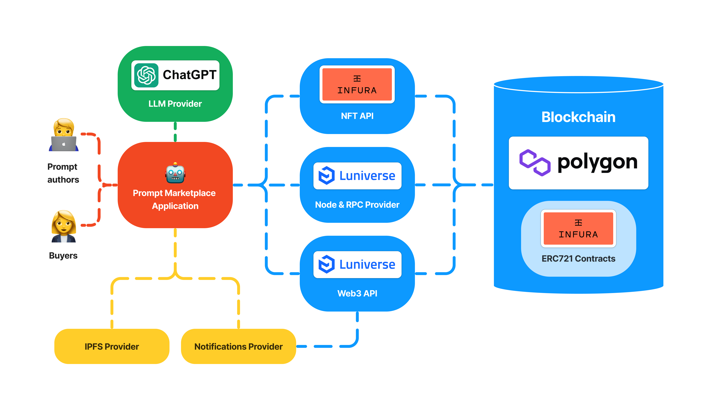

# 🤖 Prompt Marketplace

Web3 marketplace of prompts for GPT, ChatGPT, Bard and other LLM

## 🔗 Application

https://prompt-marketplace-app.vercel.app/

## ✨ Inspiration

Today ChatGPT is disrupting many industries. More and more people are beginning to use it for personal tasks and for business.

They use prompts to do this. But writing and testing effective prompts requires time and skills that not everyone has.

To help such people, we decided to build a marketplace of prompts. A place where developers can sell their work and people or businesses can try and buy it.

## 🔥 What it does

1. First, prompt author needs to create a profile. After that he can upload a prompt and place it for sale.
2. Then everyone can open the marketplace and find the prompt posted by the author.
3. Any user can test the prompt on the prompt page and buy it if they like it.
4. After purchasing the prompt, the author receives a notification.
5. There is also a list of top-selling authors on the marketplace. This way, using the top anyone can find the best developers, contact them, and order a customized solution.

## ⚒️ How we built it

- Polygon is used as a blockchain for smart contracts with profiles, prompts, marketplace.
- Infura NFT SDK is used to deploy ERC721 contracts.
- Infura NFT API is used to display pretty lists with prompts and top authors in the app.
- Luniverse Node is used to deploy contracts to Polygon and interact with them.
- Luniverse API is used to process transactions and token data before sending notifications.

## 🚀 What's next for the project

There are a lot of ideas on how to improve this project.

To make the marketplace better, it would be great to add:

- Prompts for graphic services such as DALL·E, Midjourney, Stable Diffusion.
- Copyright verification.
- User-friendly categories and search.
- Tools for quick integration after purchase.
- Features for hiring developers.

## 📃 Contracts

- Profile - 0x84c2B04DC0ec0D9B8cEf2BA11D0c2C455032007A
- Prompt - 0x3184af92a3c3c4BE1593066DAF90544e7BE9Fed2
- Marketplace - 0x75cA509E39CbAE08Ca4813E12E0297dbEff98Ae7

## 🏗️ Architecture

